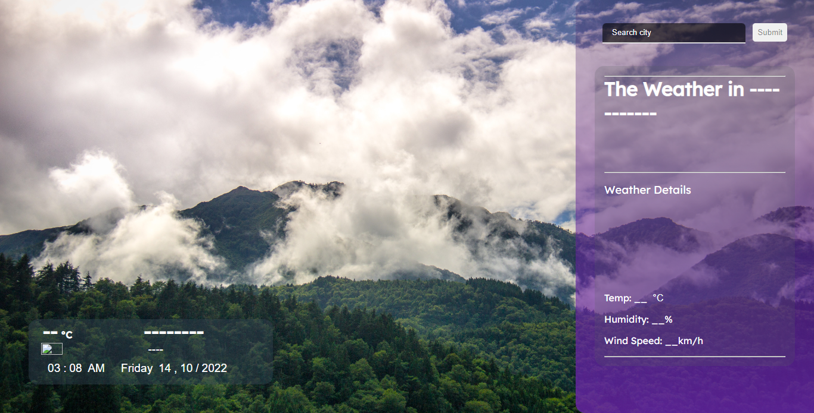
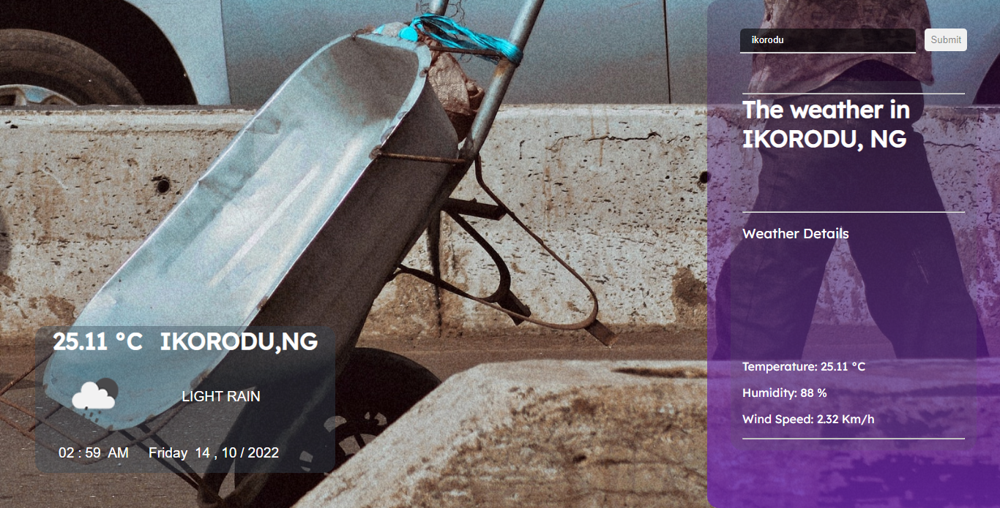
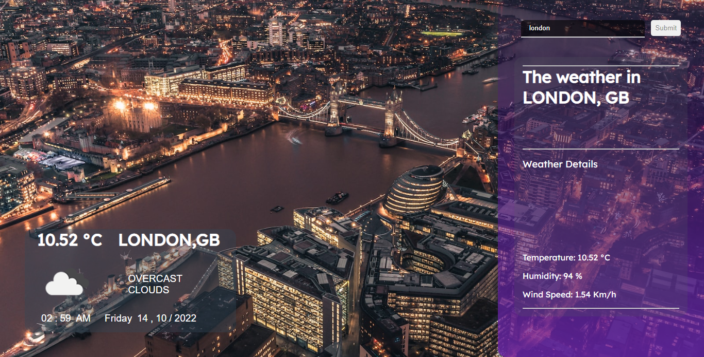
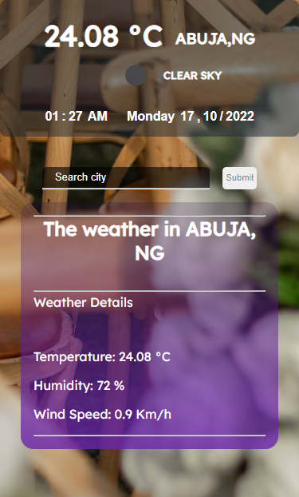
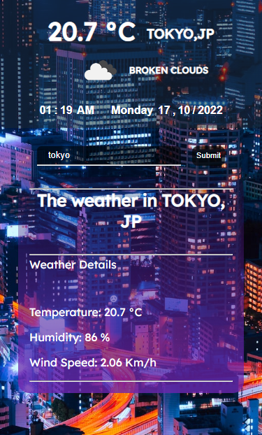
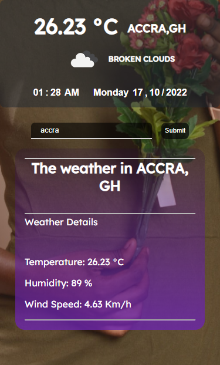

# WEATHER APP

This is a weather app i made from my continous learning of javaScript using API's. This project has help to improve my coding skills by building a realistic project. 

## Table of contents

- [Overview](#overview)
  - [The challenge](#the-challenge)
  - [Screenshot](#screenshot)
  - [Links](#links)
- [My process](#my-process)
  - [Built with](#built-with)
- [Author](#author)

## Overview

### The challenge

Users should be able to:

- Search and view the weather details update of their cities in real-time
- Get the background of the page with corresponding images relating to the name of cities searched
- Live change in location as the user types in the location into the search bar
- Receive error messages when the form is submitted if:
  - The input field is empty
  - The city name is not found by the API
- View the optimal layout depending on their device's screen size
- See hover, active, and focus states for interactive elements on the page

### Screenshot

;
;
;
;
;
;
;

### Links

- Live Site URL: [View live site](https://brodaremi.github.io/Weather-app/)

## My process

### Built with

- Semantic HTML5 markup
- Google font
- Favicon:  
- CSS custom properties
- Flexbox
- Vanilla JavaScript
- openweather.org API:  
- sources.unsplash API:  

## Author

- Twitter - [@Brodaremi](https://www.twitter.com/brodaRemi)
- Likedin - [@Momoh Remi](https://www.linkedin.com/momoh-remi)

# Weather-app
